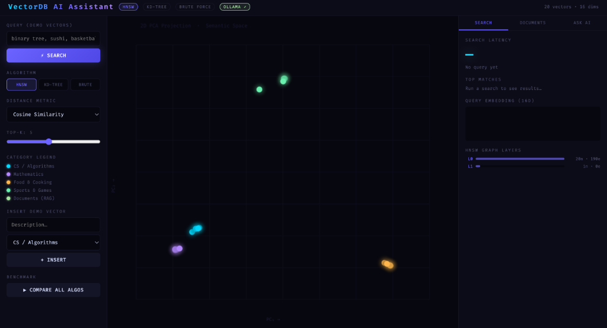
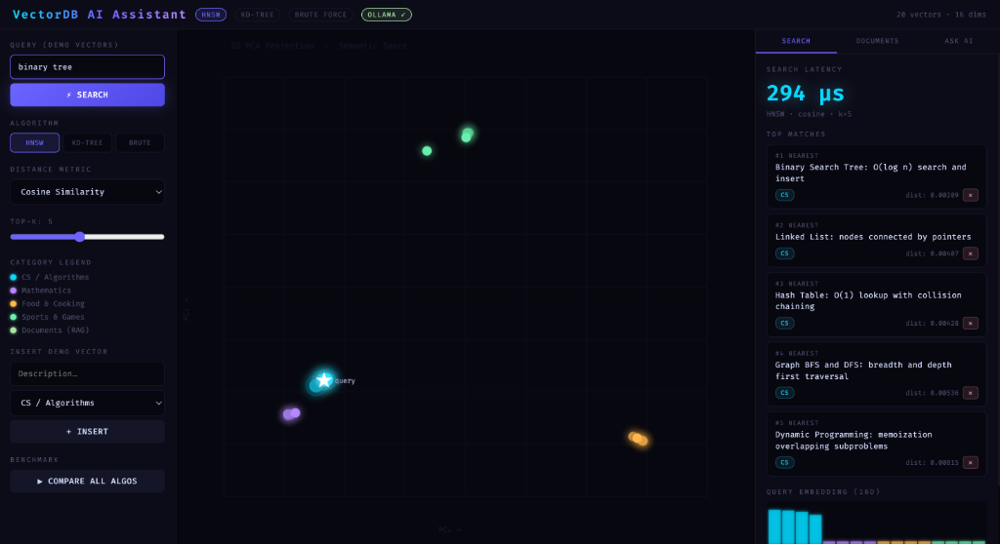
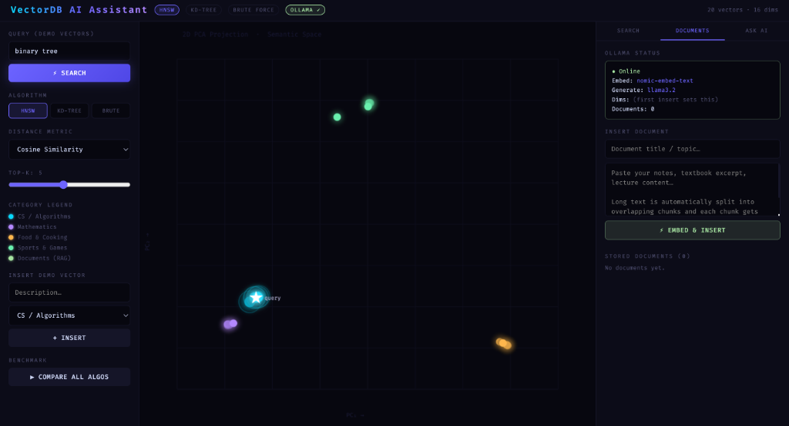
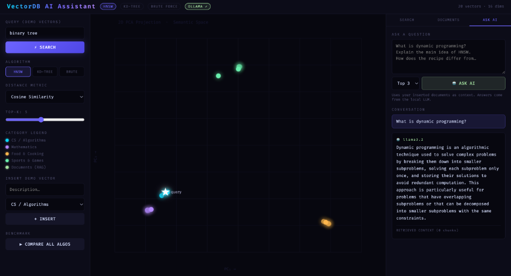

# VectorDB AI Assistant

high-performance C++ vector database built from scratch, featuring Brute Force, KD-Tree, and HNSW search algorithms. It includes a custom REST API, a responsive frontend UI with a 2D PCA scatter plot, and a Retrieval-Augmented Generation (RAG) pipeline powered by local LLMs via Ollama.


---

## Features

- **HNSW Vector Search**: High-dimensional Hierarchical Navigable Small World graph implementation for fast approximate nearest neighbor search.
- **KD-Tree Search**: Space-partitioning index optimized for exact nearest neighbor queries in low-to-medium dimensions.
- **Brute Force Search**: Exhaustive linear search providing a 100% accurate ground-truth baseline.
- **Multiple Distance Metrics**: Support for Cosine similarity, Euclidean distance, and Manhattan distance metrics.
- **Semantic Vector Search**: Live vector search and real-time visualization on pre-loaded 16D semantic dataset.
- **Interactive Visualization**: Live 2D PCA projection scatter plot visualizing cluster formations and search paths.
- **Document Embeddings**: Text chunking and embedding generation using local models.
- **Retrieval-Augmented Generation (RAG)**: Full RAG pipeline that fetches context from local documents to answer questions with an LLM.
- **REST API**: Clean endpoints for operations including search, insert, delete, stats, and benchmarks.
- **Benchmarking**: Compare execution speeds of HNSW, KD-Tree, and Brute Force search side-by-side.

---

## Tech Stack

| Technology | Purpose | Details |
|---|---|---|
| **C++17** | Core Engine | Custom database structures, indexes, and algorithm implementations |
| **Ollama** | Local AI Gateway | Local orchestration of embedding and LLM inference models |
| **Llama 3.2** | RAG Generation | Local LLM for generating answers based on retrieved context |
| **nomic-embed-text** | Text Embeddings | 768-dimensional local text embedding generation |
| **cpp-httplib** | Web Server | Lightweight single-header HTTP server for the REST API |
| **HTML5 / Vanilla CSS** | Frontend UI | Clean, modern user interface, responsive layout, dark theme |
| **JavaScript** | UI & Visualization | Handles state, API client logic, and PCA canvas rendering |

---

## Architecture

```
       +------------------------------------+
       |              User / UI             |
       +-----------------+------------------+
                         |
                         | HTTP Requests
                         v
       +-----------------+------------------+
       |             REST API               |
       +-----------------+------------------+
                         |
                         | Query & Commands
                         v
       +-----------------+------------------+
       |          VectorDB Engine           |
       +--------+--------+--------+---------+
                |        |        |
        +-------+        |        +-------+
        | HNSW           | KD-Tree        | Brute Force
        v                v                v
  +-----+----+     +-----+----+     +-----+----+
  | Indexing |     | Indexing |     | Baseline |
  +-----+----+     +-----+----+     +-----+----+
        |                |                |
        +-------+--------+--------+-------+
                         |
                         | Embeddings & Text Context
                         v
       +-----------------+------------------+
       |              Ollama                |
       |  (nomic-embed-text / llama3.2)     |
       +-----------------+------------------+
                         |
                         | Generated Answer
                         v
       +-----------------+------------------+
       |           AI Response              |
       +------------------------------------+
```

---

## Project Structure

```
vectordb-ai-assistant/
├── main.cpp        # C++ backend (HNSW, KD-Tree, Brute Force, REST API, RAG)
├── httplib.h       # Single-header C++ HTTP server library
├── index.html      # Web frontend (PCA visualization, benchmark, chat UI)
├── README.md       # Project documentation
└── .gitignore      # Git exclusion list
```

---

## Installation

### 1. Clone the repository
```bash
git clone https://github.com/Sumanth0718/vectordb-ai-assistant.git
cd vectordb-ai-assistant
```

### 2. Install Ollama
Download and install Ollama for your platform from [ollama.com](https://ollama.com).

### 3. Pull required models
Ensure Ollama is running and download the embedding and LLM models:
```bash
ollama pull nomic-embed-text
ollama pull llama3.2
```

### 4. Compile
Compile the C++ server. Any C++17 compliant compiler can be used if `clang++` is unavailable:
```bash
clang++ -std=c++17 -O2 main.cpp -o db
```

### 5. Run
Ensure the Ollama service is running, then start the VectorDB server:
```bash
./db
```
Access the web dashboard at `http://localhost:8080`.

---

## Usage

- **Search Tab**: Run queries against the demo vectors. Choose search algorithms and distance metrics to compare search speeds and paths visually.
- **Documents Tab**: Enter arbitrary text documents to automatically chunk, embed, and store in the high-dimensional index.
- **Ask AI Tab**: Query the stored documents. The engine embeds your question, runs HNSW search to retrieve relevant text chunks, and sends them to Llama 3.2 for generating a precise, context-aware answer.
- **REST API**: Integrate other applications using simple HTTP endpoints.

### API Reference

| Method | Endpoint | Description |
|---|---|---|
| `GET` | `/search` | Query database using specific algorithm and distance metric |
| `POST` | `/insert` | Add a new raw vector to the database |
| `GET` | `/benchmark` | Execute the query across all search algorithms and display timing |
| `GET` | `/hnsw-info` | Fetch current HNSW graph details, layers, and connection counts |
| `POST` | `/doc/insert` | Slice a text document, generate vector embeddings, and save to index |
| `POST` | `/doc/ask` | Retrieve relevant document context and generate LLM response (RAG) |

---

## Screenshots

### 1. Vector Search Dashboard (Initial State)


### 2. Live Query Visualization & Latency Analysis


### 3. Document Ingestion (Local Embeddings)


### 4. Ask AI Assistant (Retrieval-Augmented Generation)

